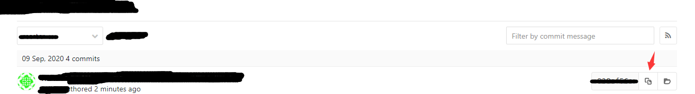

# 误提交如何回滚

## 首先获取如何要回滚到的commitID

### 方式1

终端输入git log，获取所需回滚的commitID

``` javascript
>git log
```
### 方式2

打开对应的web端，commits下获取commit




## 之后，将本机回滚到所需commit

``` 
git reset --hard yourcommitID
```

## 最后，提交到远端

提交到远端，完成回滚
``` 
git push -f 
```

注：在完成回滚时，有保护master的情况，如无push权限，应修改分支权限。
